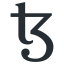

# Overview



Tezos-k8s is a collection of Helm charts and container images that can be used to deploy [Tezos](https://tezos.com) blockchain infrastructure on a Kubernetes cluster.

Use it to deploy:

* a Tezos node
* a Tezos RPC service
* a Tezos baker (coming soon)
* a Tezos private chain

on your laptop or in a cloud platform such as AWS, Digitalocean or GCP.

Tezos-k8s is actively maintained by the team at [Oxhead Alpha](https://tacoinfra.com), a Tezos core development company.

## Quick start

We assume you have access to a Kubernetes cluster and helm installed (see [Prerequisites](Prerequisites)).

To deploy a Tezos mainnet node:

1. Add the Oxhead Alpha Helm chart repository to your local Helm installation:

```
helm repo add tacoinfra https://tacoinfra.github.io/tezos-helm-charts/
```

2. Install a Tezos node:

```
helm install tezos-mainnet tacoinfra/tezos-chain \
--namespace tacoinfra --create-namespace
```

k8s will spin up an [Octez](https://tezos.gitlab.io/) node which will download and import a Tezos [mainnet tarball](https://tezos.gitlab.io/). This will take a few minutes.
